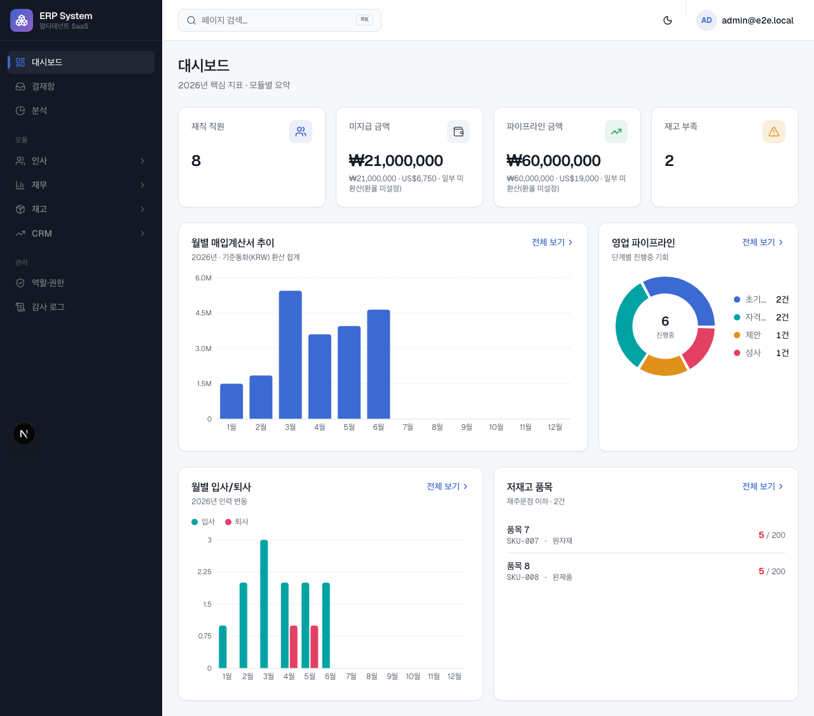
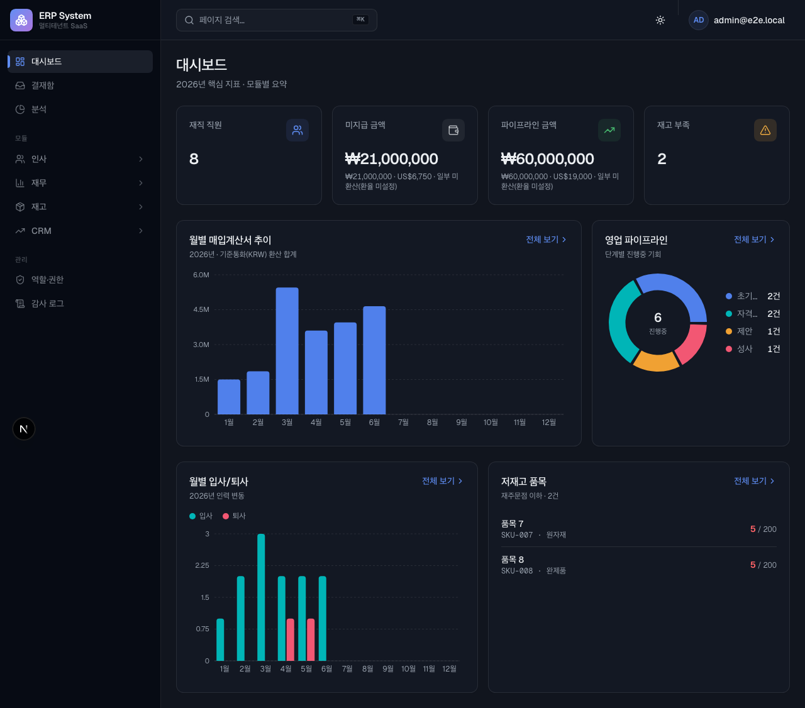
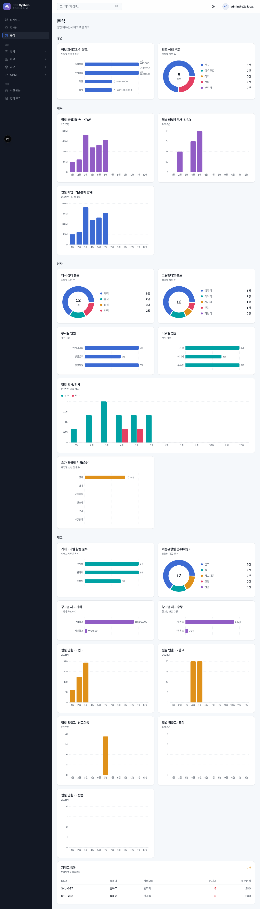
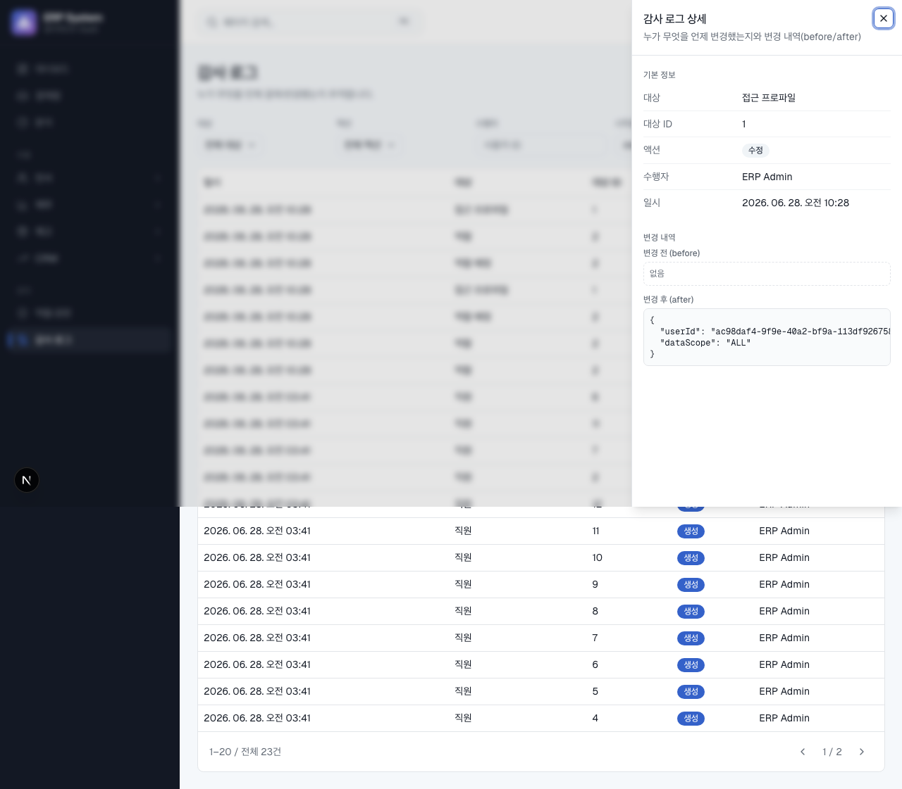
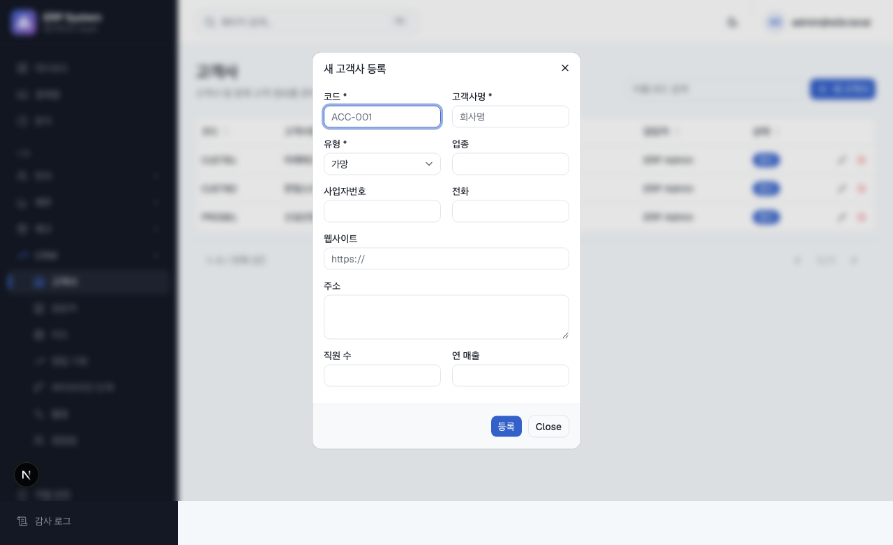
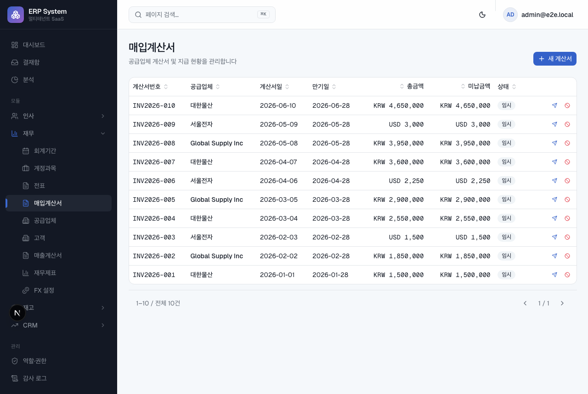
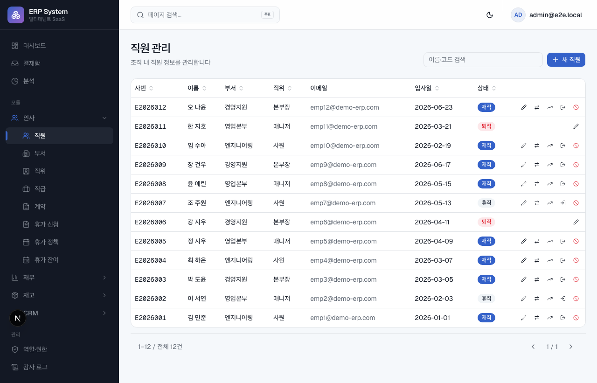
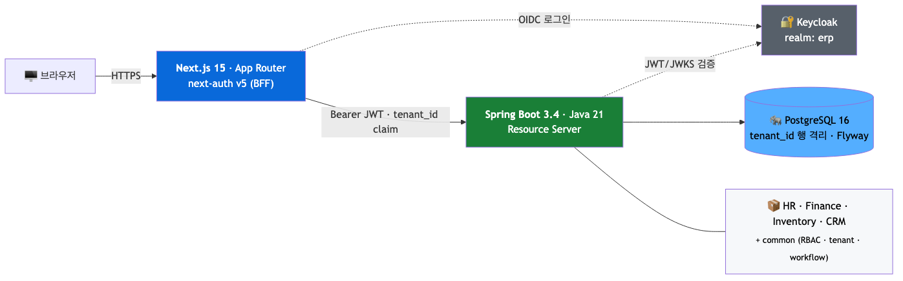
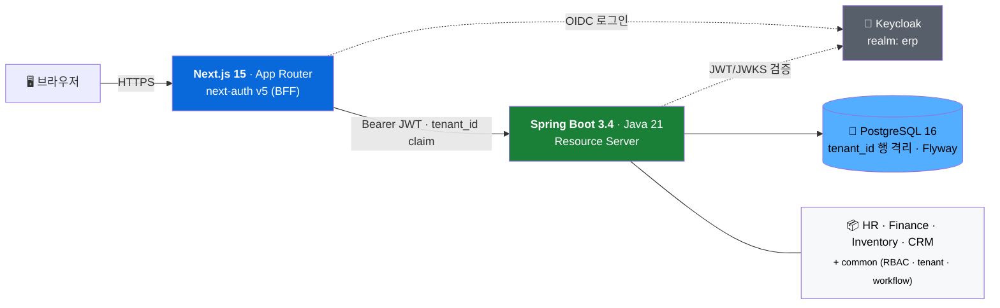

# 🏢 ERP — 멀티테넌트 SaaS ERP

[](https://github.com/grinvi04/erp/actions/workflows/ci-gate.yml)


[](LICENSE)

> **"수백 개 기업의 인사·재무·재고·영업을 한 플랫폼에서 — 테넌트별 완전 격리로."**

HR · Finance · Inventory · CRM 4개 모듈의 상용형 멀티테넌트 SaaS ERP. Spring Boot + Next.js 풀스택. 운영 미배포(로컬 풀스택 실행 지원), 현재 `v0.6.0`.

---

## 목차

- [📸 스크린샷](#-스크린샷)
- [✨ 주요 기능](#-주요-기능)
- [🧱 기술 스택](#-기술-스택)
- [🏗️ 아키텍처](#️-아키텍처)
- [🚀 시작하기](#-시작하기)
- [🧪 테스트](#-테스트)
- [📁 디렉토리](#-디렉토리)
- [📚 참고 문서](#-참고-문서)
- [📄 라이선스](#-라이선스)

---

## 📸 스크린샷

> 로컬 풀스택(실데이터)에서 캡처. [시작하기](#-시작하기)로 띄우면 `admin / Admin123!`로 직접 둘러볼 수 있다.

**대시보드** — KPI · 차트 중심, 멀티커런시 환산(미환산 명시), 저재고 경고



| 다크모드 (테마 패리티) | 분석 — 차트 |
|---|---|
|  |  |

| 감사 로그 상세 (drill-in · 변경 전/후 · 사용자명) | 고객사 등록 (인라인 검증 폼) |
|---|---|
|  |  |

| 매입계산서 — AP (직무분리 결재·지급) | 직원 관리 — HR |
|---|---|
|  |  |

## ✨ 주요 기능

| 모듈 | 핵심 기능 |
|------|-----------|
| 👥 **HR / HCM** | 조직 · 직원 · 직위/직급 · 계약 · 휴가(결재) · 분석 대시보드 |
| 💰 **Finance** | 계정과목 · 전표(GL, 결재 전기) · AP/AR(직무분리 지급/수금) · 예산 · 회계기간 · **재무제표**(시산표·손익계산서·재무상태표) · **멀티커런시/FX**(환율·거래 스냅샷·환차손익) |
| 📦 **Inventory** | 품목 · 창고 · 재고원장 · 입출이동(조정 결재) · 로트/시리얼 · 분석 대시보드 |
| 🤝 **CRM** | 고객사 · 담당자 · 리드→영업기회 · 파이프라인 · 활동 · 영업팀 데이터스코프 |

🔧 **공통 기반** — 제네릭 **결재 워크플로**(상신→승인/반려/철회) · **RBAC**(기능권한 + 데이터스코프) · **관측성**(traceId · 구조화 로깅 · Prometheus) · **감사 로그** · 기준정보 **텍스트 검색**.

## 🧱 기술 스택

| 영역 | 스택 |
|------|------|
| **Backend** | Spring Boot 3.4 · Java 21 · Gradle · PostgreSQL 16 · Flyway · Keycloak(OIDC) |
| **Frontend** | Next.js 15 (App Router) · TypeScript · next-auth v5(BFF) · Tailwind CSS · shadcn/ui |
| **Infra · CI** | Docker Compose(로컬) · GitHub Actions(ci-gate) · Playwright(E2E) |

## 🏗️ 아키텍처



<details><summary>mermaid 소스 (GitHub 웹에선 차트로 렌더)</summary>



</details>

- **클린 아키텍처** — 모듈 내 `domain`(엔티티·도메인서비스) → `application`(유스케이스·포트) → `adapter`(웹·JPA·이벤트) 3계층. 모듈 간은 `common/` 공유타입·SPI로만 통신(직접 참조 금지).
- **멀티테넌시** — 모든 테이블 `tenant_id` + Hibernate `@TenantId` 자동 필터. JWT `tenant_id` 클레임 → `TenantContext`(ThreadLocal).
- **인증·인가** — Backend는 Resource Server(JWT 검증), Frontend는 next-auth BFF(Keycloak). RBAC = Permission(기능권한) + DataScope(전체/부서/본인). 인가는 **DB 기반**(역할→권한) — 기동 시 `ERP_IAM_BOOTSTRAP_ADMIN_SUB` 미설정이면 권한 보유자 없음(fail-closed).
- **DB 표준** — BIGINT PK + 시퀀스 채번, 공통 감사 컬럼(`version` 낙관적잠금 · `deleted_at` 소프트삭제 · created/updated), Flyway forward-only(`0xxx` common · `1xxx` hr · `2xxx` finance · `3xxx` inventory · `4xxx` crm).

## 🚀 시작하기

> **전제** — Docker · JDK 21 · Node 20+

```bash
# 1) 인프라 기동 (PostgreSQL + Keycloak)
docker compose up -d

# 2) Keycloak 셋업 (realm · client · 테스트 계정, 멱등)
./scripts/keycloak-setup.sh
#    → 출력의 AUTH_KEYCLOAK_SECRET · ERP_IAM_BOOTSTRAP_ADMIN_SUB 를 다음 단계에 사용

# 3) 백엔드 (부트스트랩 + Flyway 마이그레이션)
cd backend
ERP_IAM_BOOTSTRAP_ADMIN_SUB=<2단계 출력 sub> ./gradlew bootRun
#    헬스: curl -sf http://localhost:8080/actuator/health   # {"status":"UP"}

# 4) 프론트엔드
cd ../frontend && npm install
cat > .env.local <<'EOF'
AUTH_SECRET=<openssl rand -base64 32 로 생성>
AUTH_URL=http://localhost:3000
NEXTAUTH_URL=http://localhost:3000
KEYCLOAK_ISSUER=http://localhost:8180/realms/erp
AUTH_KEYCLOAK_ID=erp-frontend
AUTH_KEYCLOAK_SECRET=<2단계 출력 secret>
BACKEND_URL=http://localhost:8080
EOF
npm run dev
```

| 구성 | URL |
|------|-----|
| 프론트엔드 | http://localhost:3000 |
| 백엔드 | http://localhost:8080 |
| Keycloak Admin | http://localhost:8180 (`admin` / `admin`) |

**테스트 계정** — `admin` / `Admin123!` → http://localhost:3000 의 **"Keycloak으로 로그인"**.
SUPER_ADMIN(전 권한)은 **백엔드를 이 계정의 Keycloak `sub`로 부트스트랩**(2~3단계)했을 때 부여된다. 다른 사용자는 관리자가 IAM 화면에서 역할을 준다.

## 🧪 테스트

```bash
# 백엔드 전체 품질 (checkstyle + 단위/통합테스트, Testcontainers Docker 필요)
cd backend && ./gradlew check

# 프론트 타입체크 · 린트 · 빌드
cd frontend && npm run type-check && npm run lint && npm run build

# 프론트 E2E (Playwright — 인증 게이트·인증 렌더 스모크, 백엔드 불필요·자체완결)
cd frontend && npm run build && npm run test:e2e
```

**백엔드 통합 E2E**(선택) — 로컬 풀스택(1~4단계)을 띄운 상태에서 실제 백엔드 데이터 렌더를 검증한다. `E2E_BACKEND` 미설정 시(CI 포함) 제외된다.

```bash
cd frontend
E2E_BACKEND=1 E2E_CLIENT_SECRET=<2단계 secret> E2E_PASSWORD=Admin123! \
AUTH_SECRET=<.env.local 과 동일> npm run test:e2e -- --project=backend
```

## 📁 디렉토리

```
backend/   Spring Boot (com.erp: common · hr · finance · inventory · crm)
frontend/  Next.js App Router (src/app · components · lib · types)
docs/      specs(기능 스펙) · milestones · deployment
scripts/   keycloak-setup.sh · init-keycloak-schema.sql
```

## 📚 참고 문서

- **작업 규약**: [`AGENTS.md`](AGENTS.md) (AI 도구 공통) · 팀 표준: `github.com/grinvi04/team-harness/docs`
- **기능 스펙**: [`docs/specs/`](docs/specs/) (analytics · 결재워크플로 · FX · 재무제표 · 환차손익 등)

## 📄 라이선스

MIT © grinvi04
